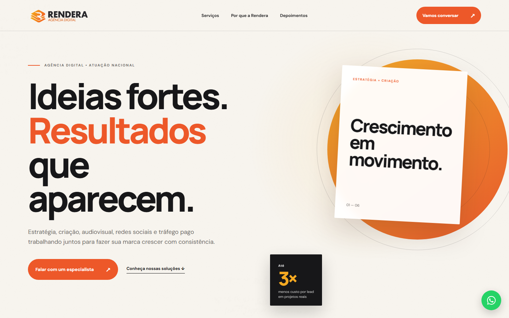
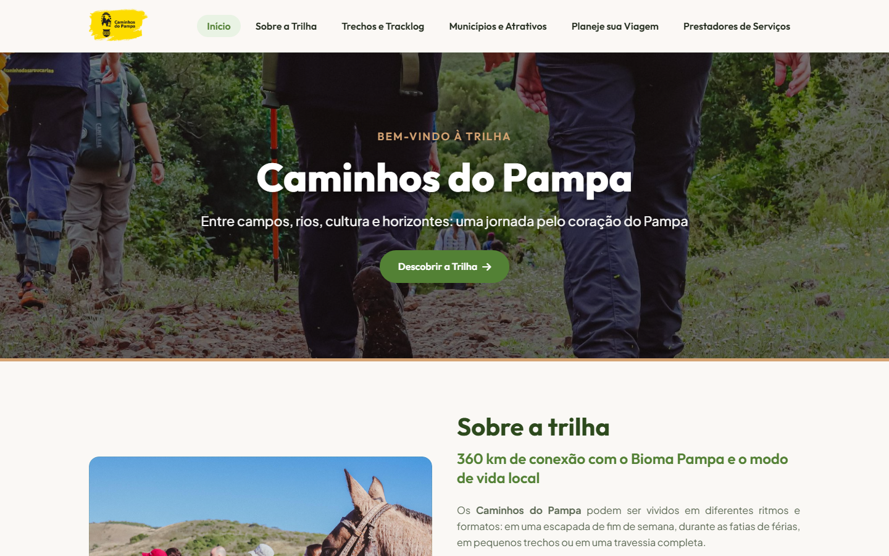
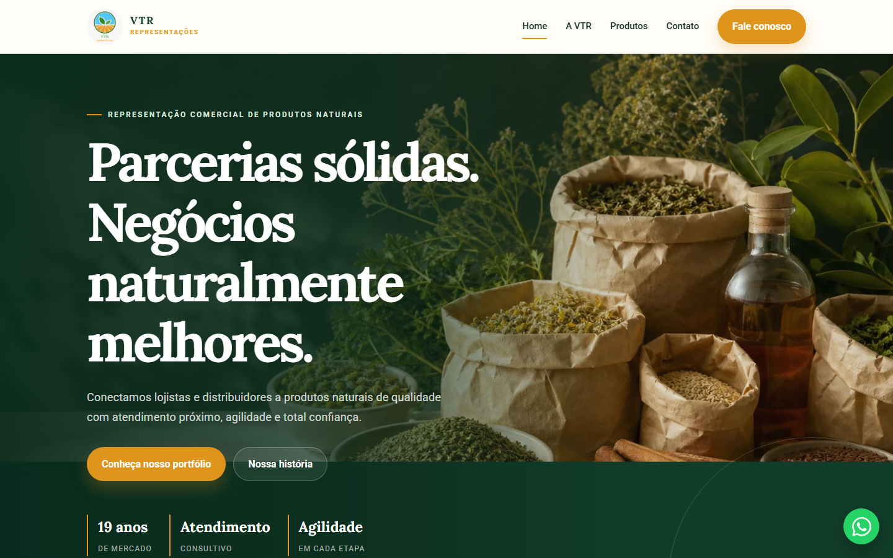
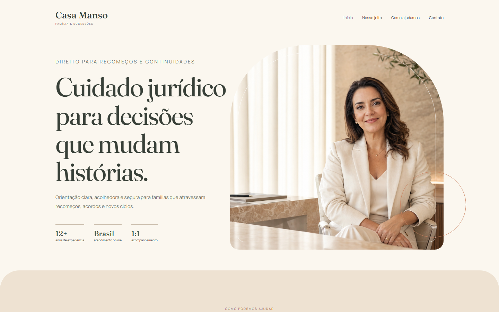
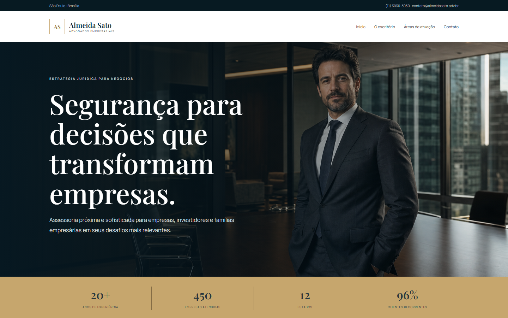
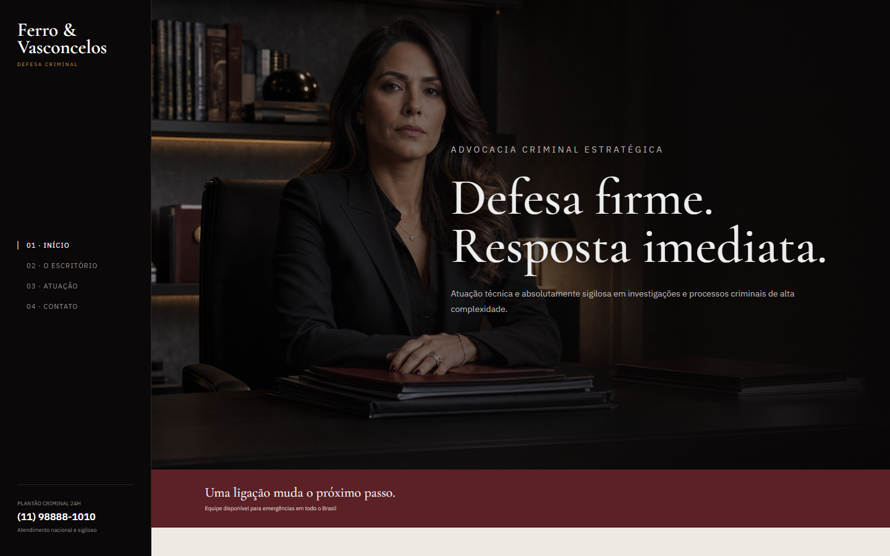

<div align="center">
  

  <h1>Papo de Prompt</h1>

  **Sites com personalidade, código bem cuidado e tecnologia que faz sentido.**

  [papodeprompt.com](https://papodeprompt.com) · [GitHub](https://github.com/Cadumendonca) · [Conversar no WhatsApp](https://wa.me/5522999259925?text=Ol%C3%A1%2C%20Carlos!%20Vim%20pelo%20GitHub%20da%20Papo%20de%20Prompt.)
</div>

---

## Olá, eu sou o Carlos 👋

Tenho 38 anos e gosto de transformar boas ideias em sites claros, bonitos e fáceis de usar.

Meu trabalho mistura design, desenvolvimento e inteligência artificial, mas começa sempre do mesmo jeito: com uma boa conversa. Antes de abrir o editor ou escrever código, procuro entender o negócio, as pessoas e o que o projeto realmente precisa resolver.

Este repositório reúne meu portfólio e alguns dos projetos que fizeram parte dessa caminhada.

## Como eu trabalho

<table>
  <tr>
    <td width="33%" valign="top">
      <strong>01 · Escuta</strong><br><br>
      Entender o momento, o público e as necessidades antes de começar a desenhar.
    </td>
    <td width="33%" valign="top">
      <strong>02 · Parceria</strong><br><br>
      Construir junto, compartilhar escolhas e manter o processo transparente.
    </td>
    <td width="33%" valign="top">
      <strong>03 · Cuidado</strong><br><br>
      Acompanhar cada detalhe, do primeiro rascunho ao site publicado.
    </td>
  </tr>
</table>

## Trabalhos selecionados

<table>
  <tr>
    <td width="50%" valign="top">
      <br>
      <strong>Rendera</strong><br>
      Arquitetura · Identidade · Website institucional
    </td>
    <td width="50%" valign="top">
      <br>
      <strong>Trilhas do Pampa</strong><br>
      Turismo · Conteúdo · Experiência digital
    </td>
  </tr>
  <tr>
    <td width="50%" valign="top">
      <br>
      <strong>VTR Representações</strong><br>
      Catálogo · Negócios B2B · Presença digital
    </td>
    <td width="50%" valign="top">
      <br>
      <strong>Casa Manso</strong><br>
      Advocacia · Marca · Website institucional
    </td>
  </tr>
  <tr>
    <td width="50%" valign="top">
      <br>
      <strong>Almeida Sato</strong><br>
      Direito empresarial · Estratégia · Interface
    </td>
    <td width="50%" valign="top">
      <br>
      <strong>Ferro Defesa</strong><br>
      Advocacia criminal · Posicionamento · Website
    </td>
  </tr>
</table>

## Sobre este portfólio

O site da Papo de Prompt foi construído sem framework para manter a base simples, rápida e fácil de publicar.

- HTML semântico;
- CSS responsivo;
- JavaScript em módulos simples;
- GSAP e ScrollTrigger para revelações durante a rolagem;
- imagens locais e screenshots reais dos projetos;
- respeito à preferência `prefers-reduced-motion`;
- links diretos para GitHub e WhatsApp.

A animação existe para apoiar o conteúdo. Quando o visitante rola a página, os elementos aparecem de forma suave, enquanto o avatar mantém uma órbita lenta com pequenas referências a design e tecnologia.

## Estrutura principal

```text
portfolio/
├── index.html
├── styles.css
├── script.js
└── assets/
    ├── avatar-papo-de-prompt.png
    └── projects/
        ├── rendera.png
        ├── trilhas-do-pampa.png
        ├── vtr.png
        ├── casa-manso.png
        ├── almeida-sato.png
        └── ferro-defesa.png
```

## Executando localmente

Por ser um projeto estático, você pode abrir `index.html` diretamente no navegador. Para evitar restrições de arquivos locais, também pode iniciar um servidor simples:

```bash
python -m http.server 8000
```

Depois, acesse:

```text
http://localhost:8000/portfolio/
```

## Tecnologias

`HTML5` · `CSS3` · `JavaScript` · `GSAP` · `ScrollTrigger`

## Vamos conversar?

Se você tem uma ideia, um negócio que precisa de uma presença digital melhor ou apenas quer trocar uma ideia sobre tecnologia, me chama.

- Site: [papodeprompt.com](https://papodeprompt.com)
- WhatsApp: [(22) 99925-9925](https://wa.me/5522999259925)
- GitHub: [@Cadumendonca](https://github.com/Cadumendonca)

---

<div align="center">
  Feito com conversa, curiosidade e cuidado.<br>
  <strong>Papo de Prompt · 2026</strong>
</div>


